# Critter Chronologer Project Starter

In this final Project the Critter Chronologer had to be implemented. Critter Chronologer a Software as a Service application that provides a scheduling interface for a small business that takes care of animals. This Spring Boot project will allow users to create pets, owners, and employees, and then schedule events for employees to provide services for pets.\
The project description can be found in the [Udacity Java-Web-Developer course](https://learn.udacity.com/nd035) in the Data Stores and Persistence chapter. The starter code was copied from [here](https://github.com/udacity/nd035-c3-data-stores-and-persistence-project-starter).

## Summary of competences
In this project I have applied the competences taught in the **Data Stores & Persistence** chapter:
* **Multitier architecture:** understanding how data storage and persistence fit into the structure of a backend application
* **Data access layer:** separating business logic from database interaction to keep the application organized and maintainable
* **JPA:** mapping Java objects to relational database tables and managing persistence through object-relational mapping
* **Data sources:** configuring a Java application to connect to a database
* **Persistence without JPA:** understanding alternative approaches to working with databases directly
* **Database interaction:** storing, retrieving, and managing application data in a structured way

## Results
### Customer Management
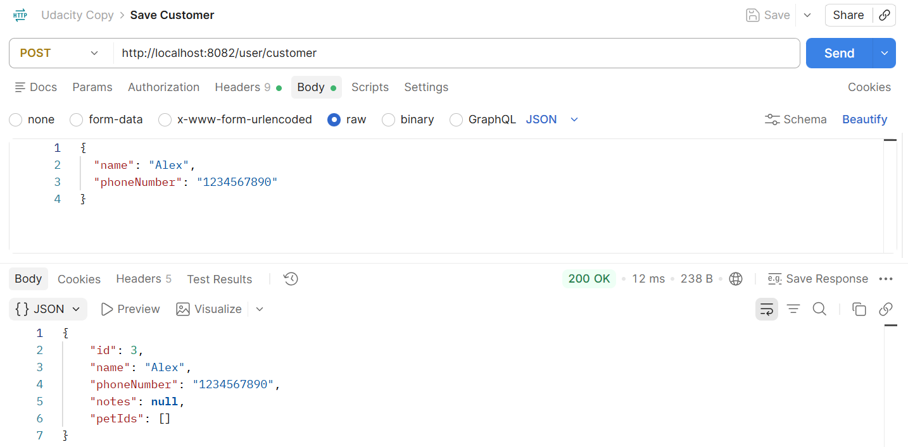
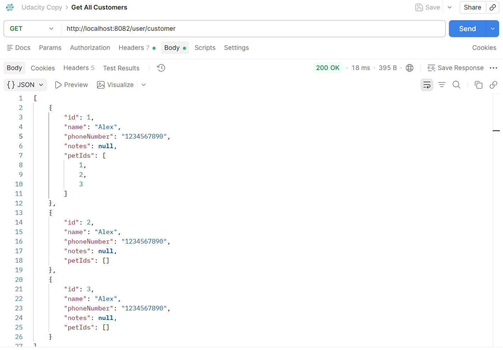
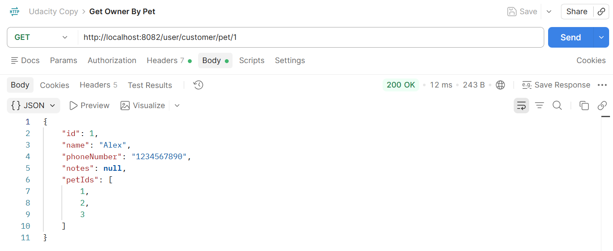

### Pet Management
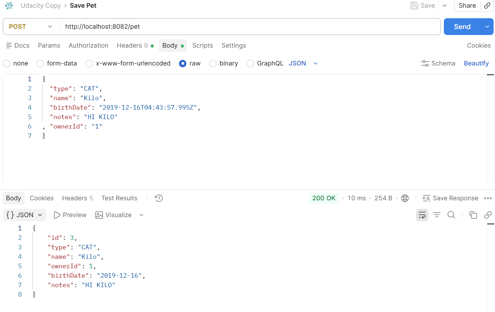
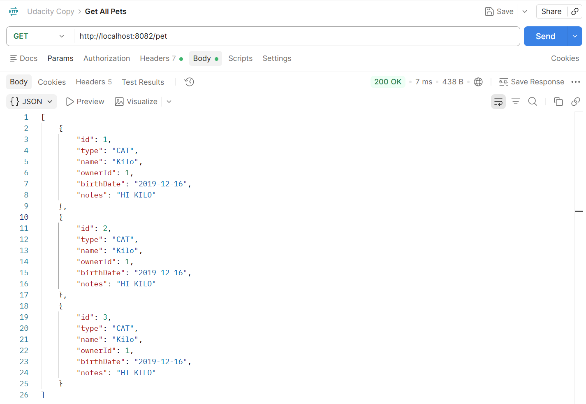
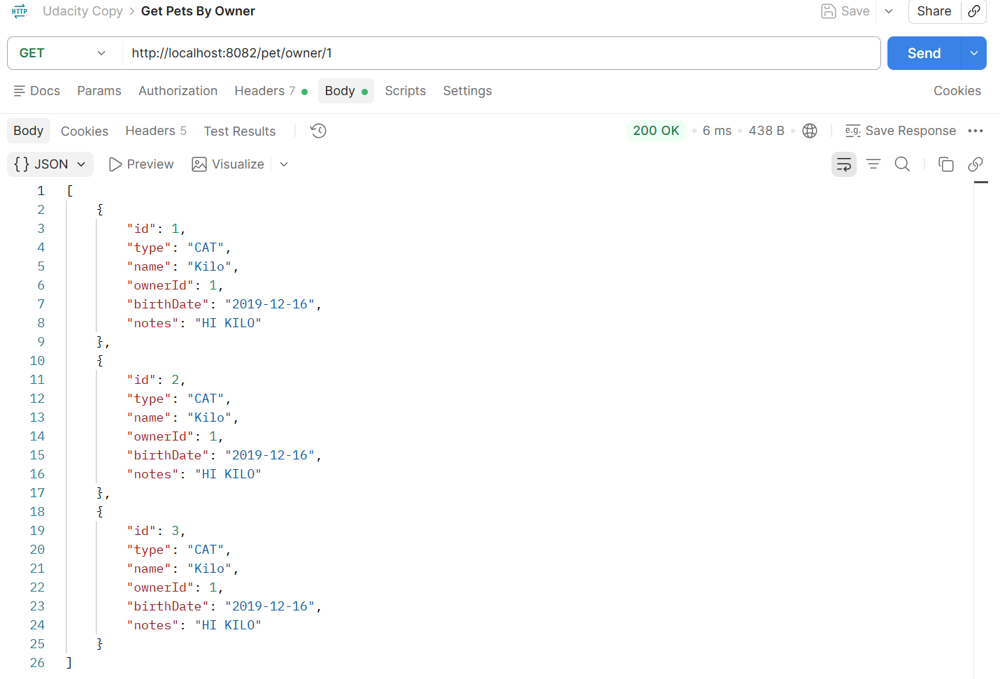
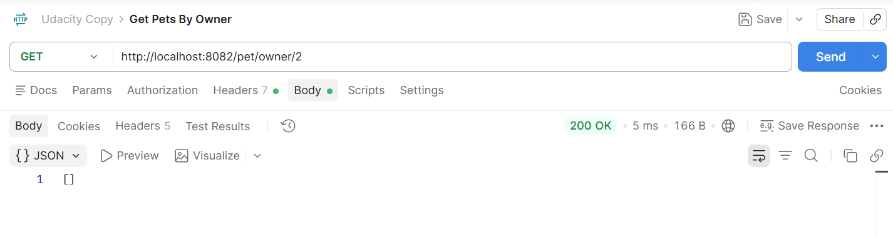

### Employee Management
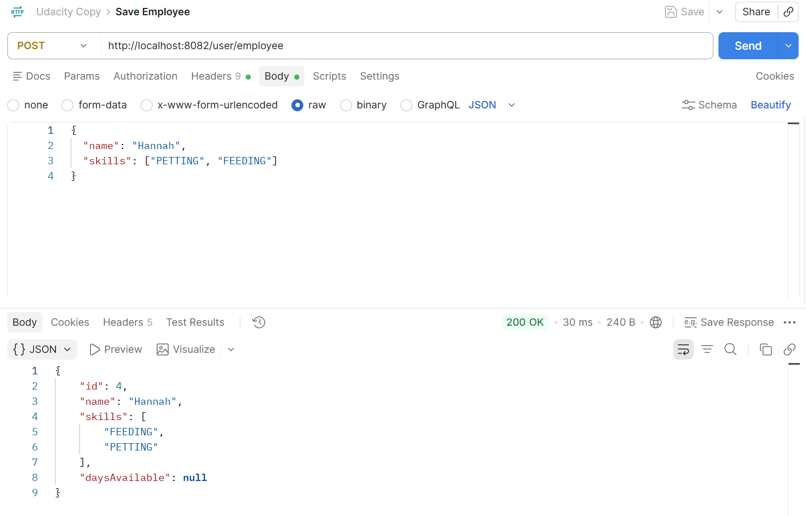
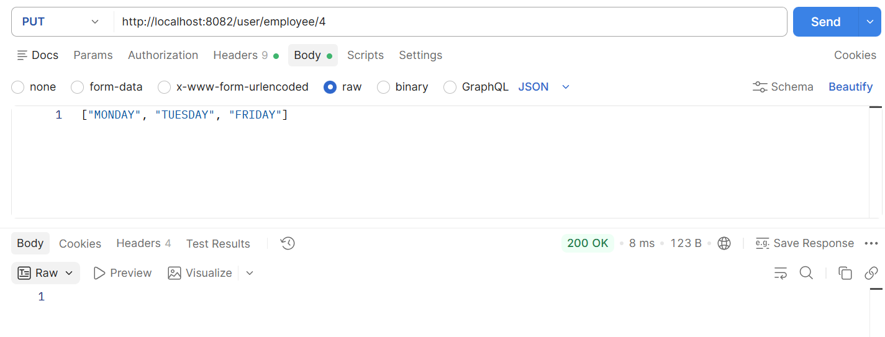
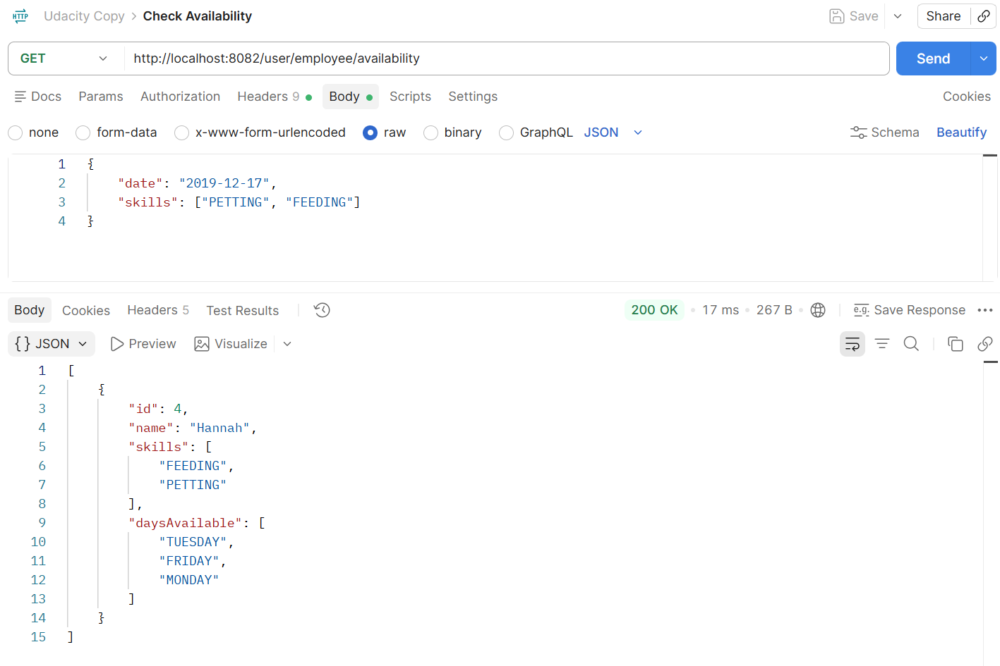

### Scheduling
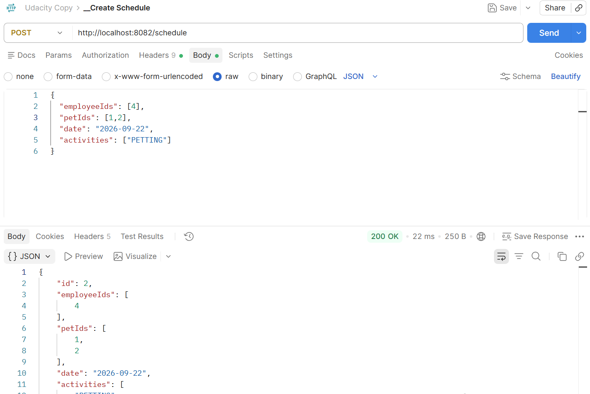
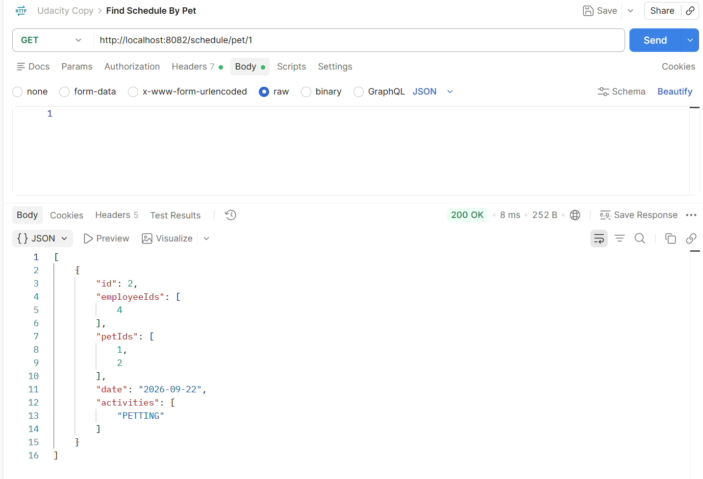
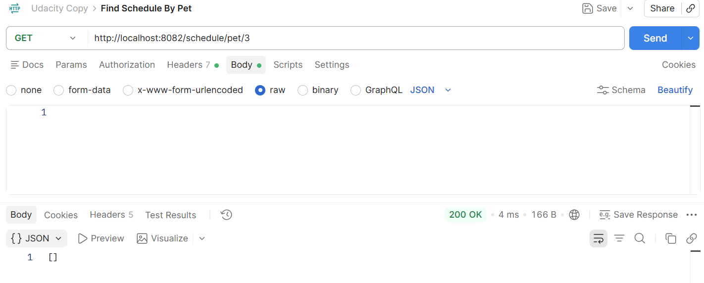
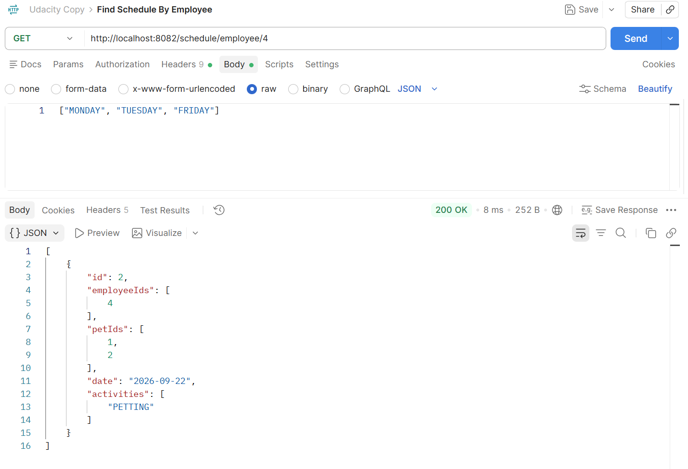
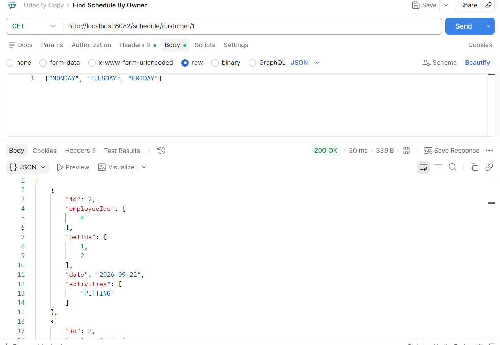
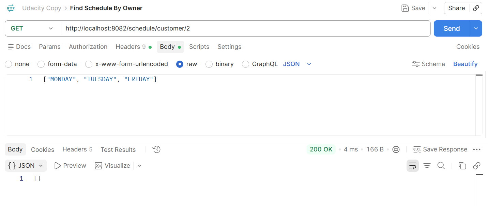

## Getting Started

### Dependencies

* [IntelliJ IDEA Community Edition](https://www.jetbrains.com/idea/download) (or Ultimate) recommended 
* [Java SE Development Kit 8+](https://www.oracle.com/technetwork/java/javase/downloads/index.html)
* [Maven](https://maven.apache.org/download.cgi)
* [MySQL Server](https://dev.mysql.com/downloads/mysql/) $\longrightarrow$ the DB-connection was implemented to use MySQL
* [Postman](https://www.getpostman.com/downloads/)

Part of this project involves configuring a Spring application to connect to an external data source. Before beginning this project, you must install a database to connect to. Here are [instructions for installing MySQL 8](https://dev.mysql.com/doc/refman/8.0/en/installing.html).

You should install the Server and Connector/J, but it is also convenient to install the Documentation and Workbench.

After installing the Server, you will need to create a user that your application will use to perform operations on the server. You should create a user that has all permissions on localhost using the sql command found [here](https://dev.mysql.com/doc/refman/8.0/en/creating-accounts.html).

### Installation

1. Clone or download this repository.
2. Open IntelliJ IDEA.
3. In IDEA, select `File` -> `Open` and navigate to the `critter` directory within this repository. Select that directory to open.
4. The project should open in IDEA. In the project structure, navigate to `src/main/java/com.udacity.jdnd.course3.critter`. 
5. Within that directory, click on CritterApplication.java and select `Run` -> `Debug CritterApplication`. 
6. Open a browser and navigate to the url: [http://localhost:8082/test](http://localhost:8082/test)

You should see the message "Critter Starter installed successfully" in your browser.

## Testing

Once you have completed the above installation, you should also be able to run the included unit tests to verify basic functionality as you complete it. To run unit tests:

1. Within your project in IDEA, Navigate to `src/test/java/com.udacity.jdnd.course3.critter`.
2. Within that directory, click on `CritterFunctionalTest.java` and select `Run` -> `Run CritterFunctionalTest`.

A window should open showing you the test executions. All 9 tests should fail and if you click on them they will show `java.lang.UnsupportedOperationeException` as the cause.

As you complete the objectives of this project, you will be able to verify progress by re-running these tests.

### Tested Conditions
Tests will pass under the following conditions:

* `testCreateCustomer` - **UserController.saveCustomer** returns a saved customer matching the request
* `testCreateEmployee` - **UserController.saveEmployee** returns a saved employee matching the request
* `testAddPetsToCustomer` - **PetController.getPetsByOwner** returns a saved pet with the same id and name as the one saved with **UserController.savePet** for a given owner
* `testFindPetsByOwner` - **PetController.getPetsByOwner** returns all pets saved for that owner.
* `testFindOwnerByPet` - **UserController.getOwnerByPet** returns the saved owner used to create the pet.
* `testChangeEmployeeAvailability` - **UserController.getEmployee** returns an employee with the same availability as set for that employee by **UserControler.setAvailability**
* `testFindEmployeesByServiceAndTime` - **UserController.findEmployeesForService** returns all saved employees that have the requested availability and skills and none that do not
* `testSchedulePetsForServiceWithEmployee` - **ScheduleController.createSchedule** returns a saved schedule matching the requested activities, pets, employees, and date
* `testFindScheduleByEntities` - **ScheduleController.getScheduleForEmployee** returns all saved schedules containing that employee. **ScheduleController.getScheduleForPet** returns all saved schedules for that pet. **ScheduleController.getScheduleForCustomer** returns all saved schedules for any pets belonging to that owner.
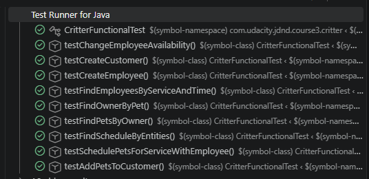
### Postman
In addition to the included unit tests, a Postman collection has been provided. 

1. Open Postman.
2. Select the `Import` button.
3. Import the file found in this repository under `src/main/resource/Udacity.postman_collection.json`
4. Expand the Udacity folder in postman.

Each entry in this collection contains information in its `Body` tab if necessary and all requests should function for a completed project. Depending on your key generation strategy, you may need to edit the specific ids in these requests for your particular project.

## Built With

* [Spring Boot](https://spring.io/projects/spring-boot) - Framework providing dependency injection, web framework, data binding, resource management, transaction management, and more.
* [Google Guava](https://github.com/google/guava) - A set of core libraries used in this project for their collections utilities.
* [H2 Database Engine](https://www.h2database.com/html/main.html) - An in-memory database used in this project to run unit tests.
* [MySQL Connector/J](https://www.mysql.com/products/connector/) - JDBC Drivers to allow Java to connect to MySQL Server

## License

This project is licensed under the MIT License - see the [LICENSE.md]()
